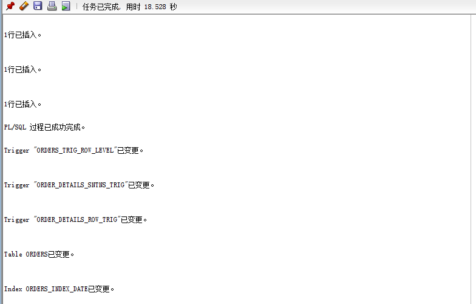
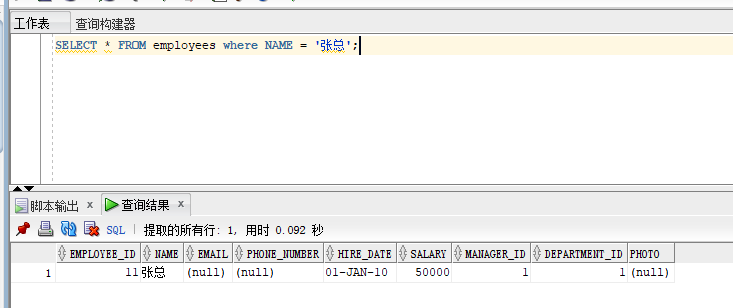
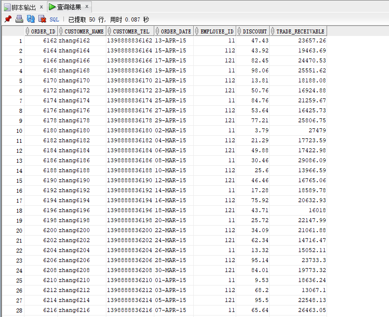
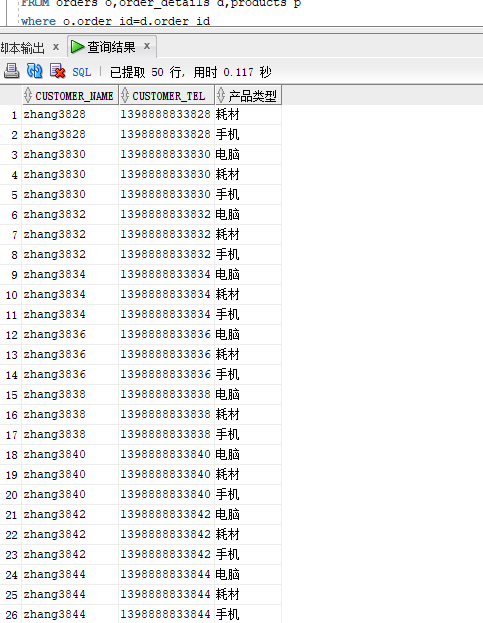
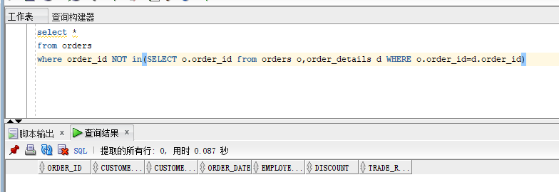
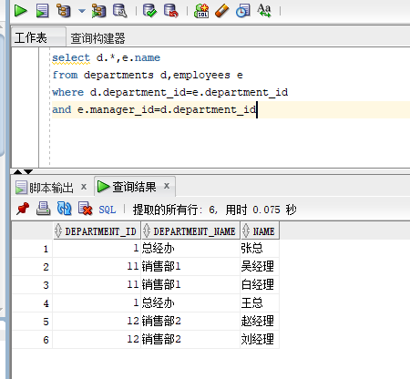
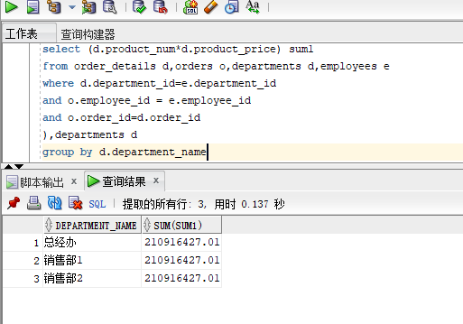

# 姓名：高洋 学号：201810414109 班级：软件工程1班

# 实验目的

    了解Oracle表和视图的概念，学习使用SQL语句Create Table创建表，学习Select语句插入，修改，删除以及查询数据，学习使用SQL语句创建视图，学习部分存储过程和触发器的使用。

# 实验场景

    假设有一个生产某个产品的单位，单位接受网上订单进行产品的销售。通过实验模拟这个单位的部分信息：员工表，部门表，订单表，订单详单表。

# 实验内容

#### 录入数据：
要求至少有1万个订单，每个订单至少有4个详单。至少有两个部门，每个部门至少有1个员工，其中只有一个人没有领导，一个领导至少有一个下属，并且它的下属是另一个人的领导（比如A领导B，B领导C）。

#### 序列的应用
插入ORDERS和ORDER_DETAILS 两个表的数据时，主键ORDERS.ORDER_ID, ORDER_DETAILS.ID的值必须通过序列SEQ_ORDER_ID和SEQ_ORDER_ID取得，不能手工输入一个数字。

#### 触发器的应用：
维护ORDER_DETAILS的数据时（insert,delete,update）要同步更新ORDERS表订单应收货款ORDERS.Trade_Receivable的值。

#### 查询数据：

    1.查询某个员工的信息
    2.递归查询某个员工及其所有下属，子下属员工。
    3.查询订单表，并且包括订单的订单应收货款: Trade_Receivable= sum(订单详单表.ProductNum*订单详单表.ProductPrice)- Discount。
    4.查询订单详表，要求显示订单的客户名称和客户电话，产品类型用汉字描述。
    5.查询出所有空订单，即没有订单详单的订单。
    6.查询部门表，同时显示部门的负责人姓名。
    7.查询部门表，统计每个部门的销售总金额。

# 实验步骤
#### 第1步：创建表，分区以及插入数据

    --运行脚本test4.sql文件
    --删除表和序列
--删除表的同时会一起删除主外键、触发器、程序包。
declare
      num   number;
begin
      select count(1) into num from user_tables where TABLE_NAME = 'DEPARTMENTS';
      if   num=1   then
          execute immediate 'drop table DEPARTMENTS cascade constraints PURGE';
      end   if;

      select count(1) into num from user_tables where TABLE_NAME = 'EMPLOYEES';
      if   num=1   then
          execute immediate 'drop table EMPLOYEES cascade constraints PURGE';
      end   if;

      select count(1) into num from user_tables where TABLE_NAME = 'ORDER_ID_TEMP';
      if   num=1   then
          execute immediate 'drop table ORDER_ID_TEMP cascade constraints PURGE';
      end   if;

      select count(1) into num from user_tables where TABLE_NAME = 'ORDER_DETAILS';
      if   num=1   then
          execute immediate 'drop table ORDER_DETAILS cascade constraints PURGE';
      end   if;

      select count(1) into num from user_tables where TABLE_NAME = 'ORDERS';
      if   num=1   then
          execute immediate 'drop table ORDERS cascade constraints PURGE';
      end   if;

      select count(1) into num from user_tables where TABLE_NAME = 'PRODUCTS';
      if   num=1   then
          execute immediate 'drop table PRODUCTS cascade constraints PURGE';
      end   if;

      select count(1) into num from user_sequences where SEQUENCE_NAME = 'SEQ_ORDER_DETAILS_ID';
      if   num=1   then
          execute immediate 'drop  SEQUENCE SEQ_ORDER_DETAILS_ID';
      end   if;

      select count(1) into num from user_sequences where SEQUENCE_NAME = 'SEQ_ORDER_ID';
      if   num=1   then
          execute immediate 'drop  SEQUENCE SEQ_ORDER_ID';
      end   if;
      select count(1) into num from user_views where VIEW_NAME = 'VIEW_ORDER_DETAILS';
      if   num=1   then
          execute immediate 'drop VIEW VIEW_ORDER_DETAILS';
      end   if;

      SELECT count(object_name)  into num FROM user_objects_ae WHERE object_type = 'PACKAGE' and OBJECT_NAME='MYPACK';
      if   num=1   then
          execute immediate 'DROP PACKAGE MYPACK';
      end   if;
    end;
    /
    ...

运行结果：

#### 第2步：查询某个员工的信息：

    SELECT * FROM employees where NAME = '张总';

操作截图：

#### 第3步：递归查询某个员工及其所有下属，子下属员工:

    WITH A (EMPLOYEE_ID,NAME,EMAIL,PHONE_NUMBER,HIRE_DATE,SALARY,MANAGER_ID,DEPARTMENT_ID) AS
      (SELECT EMPLOYEE_ID,NAME,EMAIL,PHONE_NUMBER,HIRE_DATE,SALARY,MANAGER_ID,DEPARTMENT_ID
        FROM employees WHERE employee_ID = 11
        UNION ALL
      SELECT B.EMPLOYEE_ID,B.NAME,B.EMAIL,B.PHONE_NUMBER,B.HIRE_DATE,B.SALARY,B.MANAGER_ID,B.DEPARTMENT_ID
        FROM A, employees B WHERE A.EMPLOYEE_ID = B.MANAGER_ID)
    SELECT * FROM A;
    

#### 第4步：查询订单表，并且包括订单的订单应收货款: Trade_Receivable= sum(订单详单表.ProductNum*订单详单表.ProductPrice)- Discount:

    select * FROM ORDERS

操作截图：

#### 第5步：查询订单详表，要求显示订单的客户名称和客户电话，产品类型用汉字描述：
    
    select o.customer_name,o.customer_tel, p.product_type AS 产品类型
    FROM orders o,order_details d,products p
    where o.order_id=d.order_id
    and d.product_name=p.product_name

操作截图

#### 第6步：查询出所有空订单，即没有订单详单的订单：

    select * 
    from orders
    where order_id NOT in(SELECT o.order_id from orders o,order_details d WHERE o.order_id=d.order_id)

#### 第7步：查询部门表，同时显示部门的负责人姓名：
    
    select d.*,e.name
    from departments d,employees e
    where d.department_id=e.department_id
    and e.manager_id=d.department_id

操作结果：

#### 第8步：查询部门表，统计每个部门的销售总金额：

    select d.department_name,sum(sum1)
    from (
    select (d.product_num*d.product_price) sum1
    from order_details d,orders o,departments d,employees e
    where d.department_id=e.department_id
    and o.employee_id = e.employee_id
    and o.order_id=d.order_id
    ),departments d
    group by d.department_name

操作结果：

# 总结

    在这次的实验中，我大致的对Oracle的对象有了一定的了解，对象及指逻辑上的概念而不是物理上的概念。
