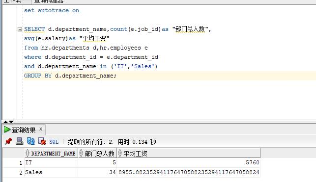
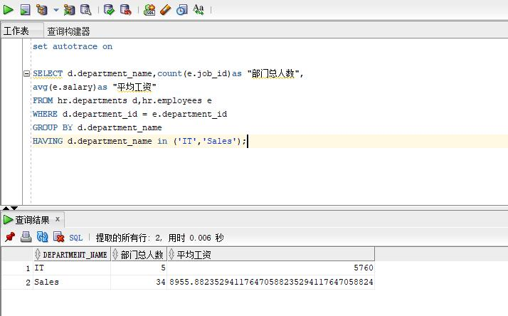
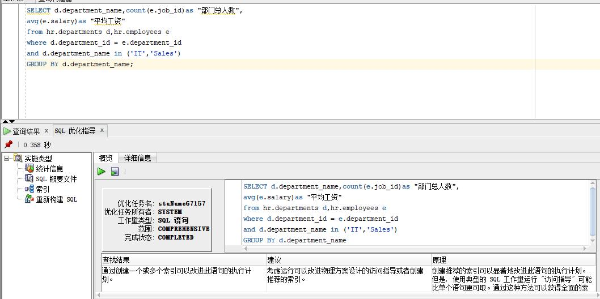

# 姓名：高洋 学号：201810414109 班级：软件工程1班

## 实验目的

    分析SQL执行计划，执行SQL语句的优化指导。理解分析SQL语句的执行计划的重要作用。

## 实验内容

    对Oracle12c中的HR人力资源管理系统中的表进行查询与分析。
    首先运行和分析教材中的样例：本训练任务目的是查询两个部门('IT'和'Sales')的部门总人数和平均工资，以下两个查询的结果是一样的。但效率不相同。
    设计自己的查询语句，并作相应的分析，查询语句不能太简单。

## 教材中的查询语句	

查询1：

查询2：

## 优化执行

    该方法通过创建一个或多个索引词可以改进。可以在运行时考虑改进物理方案设计的访问指导或者创建推荐的索引。创建推荐的索引可以改进此语句的执行计划是因为通过这种方法可以获得全面的索引建议方案。

## 自行索引

    这种索引是将所有部门和部门的人数都展示出来